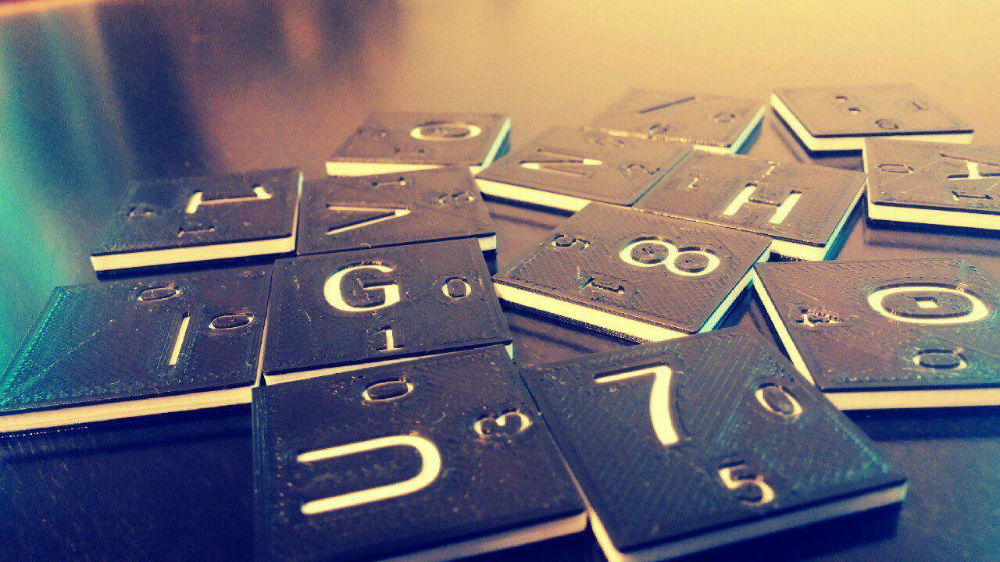

# Simetrická šifra LS47
LS47 vychází ze šifry ElsieFour popsaná Alanem Kaminsky, LS47 je mírně vylepšená, jsou přidané znaky, původní velikost pole bylo 6x6, a v této rozšířené verzi je pole velké 7x7, aby bylo možné šifrovat některé strukturované informace. Rovněž popisuje jednoduchý
expanzní klíč - algoritmus, který funguje na bázi hesla.



### Znaková tabulka

LS47 obsahuje navíc základní interpunkce, pro možnost psát výrazy a citace.
```
_ a b c d e f
g h i j k l m
n o p q r s t
u v w x y z .
0 1 2 3 4 5 6
7 8 9 , - + *
/ : ? ! ' ( )
```

Destičky při přiblížení vypadají takto, je na nich i poloha, která se bude využívat k šifrování a dešifrování.

```
/-----\  /-----\  /-----\  /-----\  /-----\
|     |  |     |  |     |  |     |  |     |
| _  0|  | a  1|  | b  2|  | c  3|  | d  4|  ...
|   0 |  |   0 |  |   0 |  |   0 |  |   0 |
\-----/  \-----/  \-----/  \-----/  \-----/

/-----\  /-----\
|     |  |     |
| g  0|  | h  1|  ...
|   1 |  |   1 |
\-----/  \-----/
   .        .
   .        .
   .        .
```

K ručnímu šifrování je zapotřebý ještě takzvaný "Marker"značka, může to být libovolný předmět, kamínek, kroužek. 

## Jak na to

Kostičky si rozložíme před sebe do čtverce, jejich permutace je
tajný klíč. Značku (Marker) [M] položíme doleva nahoru.

### Šifrování
1. Najdeme vstupní písmeno: pozice nešifrované kostičky + offset na pozici markeru = pozice zašifrovaného písmena
2. Řádek s nezašifrovaným písmenem rotujeme o 1 doprava
3. Sloupec se zašifrovaným písmenem o 1 dolů
4. Žnačku (Marker) posuneme o offset na kostičce se zašifrovaným písmenem

#### Encryption example with ascii images!

```
1,2. Symmetric key with         3,4. We want to encrypt 'y'.
     marker put on 'e'               Look at the marked tile:

  [e]f _ a b c d                     /-----\
   l m g h i j k                     |     |
   ( ) / : ? ! '                     | e  5|
   s t n o p q r                     |   0 |
   z . u v w x y                     \-----/
   5 6 0 1 2 3 4
   + * 7 8 9 , -

5. Ciphertext is 'w'            6. Rotate the plaintext 1 position
   (='y' moved by (5,0))           right, keep marker coordinates.

                               [e]f _ a b c d        [e]f _ a b c d
   Output 'w'!                  l m g h i j k         l m g h i j k
                                ( ) / : ? ! '         ( ) / : ? ! '
                                s t n o p q r         s t n o p q r
                                  z . u v w x y  >>   y z . u v w x
                                5 6 0 1 2 3 4         5 6 0 1 2 3 4
                                + * 7 8 9 , -         + * 7 8 9 , -


7. Rotate the ciphertext 1         Now look at the ciphertext tile:
   position down.

   [e]f _ a b , d                       /-----\
    l m g h i c k                       |     |
    ( ) / : ? j '                       | w  2|
    s t n o p ! r                       |   3 |
    y z . u v q x                       \-----/
    5 6 0 1 2 w 4
    + * 7 8 9 3 -

8. Update the marker position         9. GOTO 3.
   by ciphertext offset (2,3).


    e f _ a b , d
    l m g h i c k
    ( ) / : ? j '
    s t[n]o p ! r
    y z . u v q x
    5 6 0 1 2 w 4
    + * 7 8 9 3 -


```

### Dešifrování
Proces dešifrování je podobný:
1. Najdeme zašifrované vstupní písmeno: pozice kostičky (mínus) – offset na pozici markeru = pozice dešifrovaného písmena
2. Řádek s rozluštěným písmenem rotujeme o 1 doprava
3. Sloupec s nerozluštěným písmenem o 1 dolů
4. Značku (Marker) posuneme o offset na kostičce se nerozluštěným písmenem


### Key generation

Grab a bag full of tiles and randomly draw them one by one. Key is the 49-item permutation of them.

### Key expansion from a password

Remembering 49-position random permutation that includes weird characters is
not very handy. You can instead derive the keys from an arbitrary string of
sufficient length.

"Sufficient" means "provides enough entropy". Full keys store around 208 bits
of entropy. To reach that, your password should have:

- at least around 61 decimal digits if made only from random decimal digits
- at least around 44 letters if made only from completely random letters
- at least around 40 alphanumeric characters if made randomly only from them

To have the "standard" 128 bits of entropy, the numbers reduce to roughly 39,
28 and 25, respectively.

Note that you can save the expanded tile board for later if you don't want to
expand the passwords before each encryption/decryption.

The actual expansion can be as simple as this:

1. initialize `I:=0`, put the tiles on the board sorted by their numbers (i.e. as on the picture above)
2. Take the first letter of the password and see the numbers on its tile; mark them `Px, Py`.
3. Rotate `I`-th row `Px` positions right
4. Rotate `I`th column `Py` positions down
5. `I := I + 1 mod 7`, repeat from 2 with next letter of the password.
6. Resulting tile positions are the expanded key

### Undistinguishable ciphertexts

To get a different ciphertext even if the same plaintext is encrypted
repeatedly; prepend it with a nonce. A nonce is a completely random sequence of
letters of a pre-negotiated length (e.g. N tiles drawn randomly from a bag,
adviseable value of N is at least 10).

You may also want to add a random number of spaces to the end of the ciphertext
-- it prevents the enemy from seeing the difference between ciphertexts of 'yes
please' and 'no', which would otherwise encrypt to gibberish that is easily
distinguishable by length, like `qwc3w_cs'(` and `+v`.

### Authenticated encryption

Because ciphertext may be altered in the transfer or during the error-prone
human processing, it is advised to append a simple "signature" to the end of
the message; which may look as simple as `__YourHonorableNameHere`. If the
signature doesn't match expectations (which happens with overwhelming
probability if there was any error in the process), either try again to see if
you didn't make a mistake, or discard the message and ask the sender to
re-transmit.

This works because the cipher output is message-dependent: Having a wrong bit
somewhere in the middle causes avalanche effect and erases any meaning from the
text after several characters.

## References

[1] *Kaminsky, Alan. "ElsieFour: A Low-Tech Authenticated Encryption Algorithm For Human-to-Human Communication." IACR Cryptology ePrint Archive 2017 (2017): 339.*